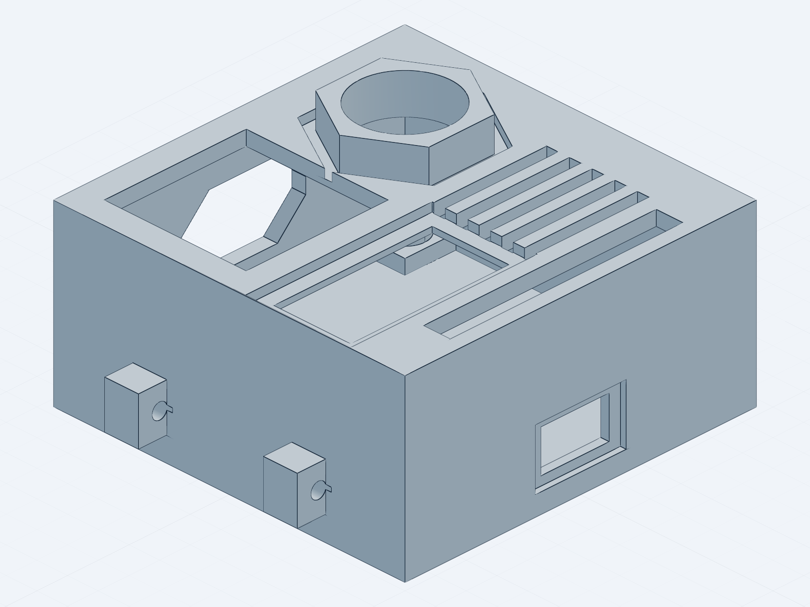
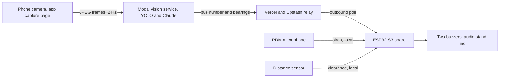

# Tacta, Bus-Stop Situational Awareness for DeafBlind Users

Tacta is a wrist-worn prototype for DeafBlind travellers at a bus stop. A local microphone
detects an urgent siren. A phone camera and a cloud vision service read which bus arrived, and
the board reports the result through two buzzers.

The team built Tacta at the Axiometa and Anthropic hardware hack in London, from 17 to 19 July
2026.

> Honest scope, up front. This prototype has no working tactile output. The two on-board
> buzzers failed the bench haptic test. They now stand in as two audible tones for two future
> vibration channels. The team has not tested Tacta with DeafBlind users. Read the
> [Limitations](#limitations) section below.



The plan is the single authoritative build target. Read
[`plan/2026-07-18-bus-stop-situational-awareness.md`](plan/2026-07-18-bus-stop-situational-awareness.md).
If the code or these docs disagree with the plan, the plan wins.

## System diagram



## Hardware

An ESP32-S3 "Genesis Mini" board carries four snap-in modules. A phone browser camera supplies
the video. All four ports are occupied.

| Port | Module | Function |
|---|---|---|
| `P1` | AX22-0018 passive buzzer | Audible tone at 2350 Hz. A stand-in for a future vibration channel |
| `P2` | VL53L0CX time-of-flight sensor | Forward distance. A clearance warning only |
| `P3` | AX22-0018 passive buzzer | Audible tone at 3050 Hz. A stand-in for a future vibration channel |
| `P4` | AX22-0044 PDM microphone | Local siren detection |
| Phone camera | Phone browser camera | Bus video through the app capture page |

The two AX22-0018 buzzers were audible on the bench but produced almost no felt movement. The
team rejected them as haptic actuators. They remain only as two audible tones. See
[`docs/lra-motor-upgrade.md`](docs/lra-motor-upgrade.md) for the vibration-motor upgrade path.

## Software stack

Four parts meet at the shared contract in [`app/src/lib/contract.ts`](app/src/lib/contract.ts).

- **`app/`** is a Next.js 16 web app on Vercel and Upstash Redis. It runs the phone camera
  capture at 2 Hz, the device relay API, and the output monitor. See
  [`app/README.md`](app/README.md).
- **`vision/service.py`** is a Modal service. It runs YOLO detection. Then Claude reads the bus
  number under a strict JSON schema. The demo locks the reading to route 88 and Clapham Common.
  See [`MODAL-FOR-APP.md`](MODAL-FOR-APP.md).
- **The relay** runs on Vercel and Upstash Redis. It carries commands to the board. The board
  polls the relay outbound only and never accepts an inbound connection. See
  [`RELAY-FOR-FIRMWARE.md`](RELAY-FOR-FIRMWARE.md).
- **`firmware/braille_wearable/`** holds the PlatformIO firmware, environment `board_firmware`.
  It runs the local siren and distance paths offline. The directory keeps its old name so the
  firmware build does not break.

### Demo phases

The demo runs in two activity phases. The phone reports the phase.

- In `MOVING`, the board keeps the bus output silent. It keeps the local distance and siren
  alerts active. The cane remains the primary mobility aid.
- In `STILL`, the board stops the distance output. It keeps the siren output. It shows the bus
  arrival and the route-88 output.

Camera bearings (`LEFT`, `RIGHT`, `AHEAD`) are advisory. They tell the wearer where the bus sits
in frame. They work in both phases. They never outrank the local distance and siren paths.

## Quick start

Each area has its own doc with the full sequence. Do not copy flags from memory.

Start the web app from `app/`.

```bash
cd app
pnpm install
pnpm run build     # production build
pnpm dev           # local work at http://localhost:3000
```

See [`app/README.md`](app/README.md) for the env setup.

Build the firmware from `firmware/braille_wearable/`.

```bash
cd firmware/braille_wearable
pio run -e board_firmware
```

See [`firmware/braille_wearable/BOARD_FIRMWARE.md`](firmware/braille_wearable/BOARD_FIRMWARE.md)
and [`RELAY-FOR-FIRMWARE.md`](RELAY-FOR-FIRMWARE.md).

Deploy the Modal vision service.

```bash
modal deploy vision/service.py
```

Modal prints a URL. Add the `/ingest` path. Paste the result into the web app as
`NEXT_PUBLIC_MODAL_URL`. See [`MODAL-FOR-APP.md`](MODAL-FOR-APP.md).

Run the demo from [`DEMO-RUNBOOK.md`](DEMO-RUNBOOK.md). It has the stage sequence and the
fallbacks.

## Repository map

| Path | Contents |
|---|---|
| [`app/`](app/) | Next.js 16 web app. Capture page, device relay, output monitor |
| [`vision/`](vision/) | Modal vision service (`service.py`). YOLO detection and Claude route reading |
| [`firmware/`](firmware/) | PlatformIO ESP32-S3 firmware, environment `board_firmware` |
| [`cad/`](cad/) | Parametric enclosure (build123d). Builds headless |
| [`parts/`](parts/) | Vendor datasheets and STEP files. Mirrors the vendor catalogue, not the bench |
| [`demo/`](demo/) | Demo fixtures. The synthetic siren audio |
| [`renders/`](renders/) | Enclosure renders |
| [`docs/`](docs/) | Forward-direction notes. The LRA upgrade path |
| [`plan/`](plan/) | The authoritative plan |

## Limitations

This is a hackathon prototype. The following limits are load-bearing, not disclaimers.

- Tactile output failed. The two AX22-0018 buzzers are audible stand-ins at 2350 Hz and
  3050 Hz. They are not working haptics. They prove nothing about body-worn vibration.
- The distance sensor is not navigation. The single forward zone gives a clearance warning
  only. It never says `LEFT`, `RIGHT`, or `AHEAD`, and no local sensor output is navigation.
- Camera bearings are advisory. `LEFT`, `RIGHT`, and `AHEAD` describe where the bus sits in
  frame. They are not obstacle avoidance. They never outrank the local safety paths.
- The team has not tested with DeafBlind users. This is a prototype, not an accessibility
  product.
- Route 88 and Clapham Common are hardcoded on purpose. This is a demo lock, not general
  bus-reading.

## Next iteration

- Replace the buzzers with real vibration motors. The target part is the LRA module AX22-0039.
  See [`docs/lra-motor-upgrade.md`](docs/lra-motor-upgrade.md).
- Test with DeafBlind users. Nothing here is validated until the community it serves tries it.
- Remove the route-88 and Clapham Common hardcode so the reader works for any bus.

## Contributing

[`AGENTS.md`](AGENTS.md) documents the AI-assisted workflow. Claude Code and Codex both work
from that file. Read it before you change code. CI runs on pull requests through
[`.github/workflows/verify.yml`](.github/workflows/verify.yml). Run the verification commands
for the area you touch. Keep the route-88 and Clapham Common hardcode unless you change the plan
first.
