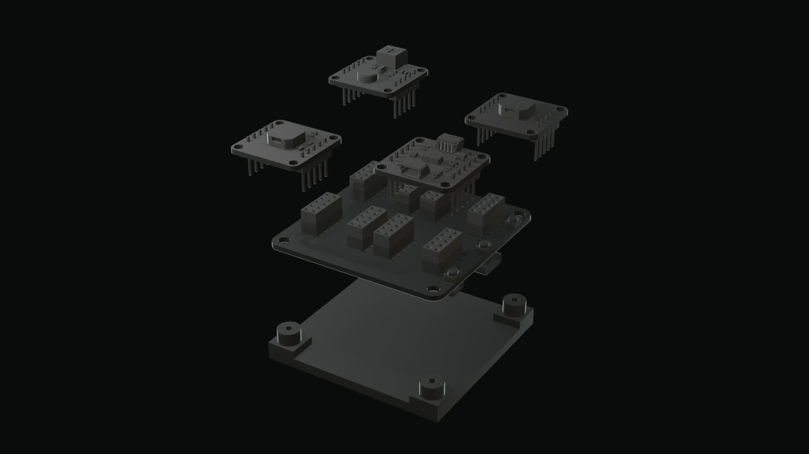
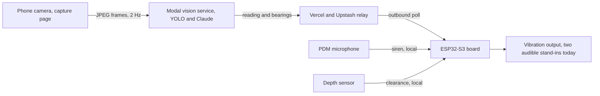

# Tacta

Tacta is an open project toward one wearable device. The device gives DeafBlind
people a sense of the world around them, through touch. It fuses several senses
into vibration.

Cameras read the scene. Microphones pick out important sounds. Depth sensors
feel the space around the wearer. Tacta turns all three into touch. The project
is open source so more people, more money, and better engineering can build the
real thing.



This repository holds a hackathon prototype. The team built it at the Axiometa
and Anthropic hardware hack in London, from 17 to 19 July 2026. The prototype
wires the idea end to end with off-the-shelf modules and a phone camera. It
locks the demo to one concrete scene so the story stays clear. The scene reads a
specific bus at a stop. That scene is one example, not the product.

> Honest scope. This is a hackathon prototype, not a finished accessibility
> product. The two on-board buzzers failed the bench haptic test. They now stand
> in as two audible tones for two future vibration channels. The single depth
> sensor gives a clearance warning, not navigation. The team has not tested Tacta
> with DeafBlind people. Read the [Limitations](#limitations) section.

## How it senses the world

Tacta fuses three channels. Each channel does a small job today. Each channel
points at a larger job in the real product.

### Vision

The cameras read the scene. Today, the phone camera sends frames to a cloud
vision service. The service finds objects and reads text, like a route number on
a vehicle or the words on a sign. A future version uses on-board cameras. It
reads more of the scene, including what is ahead and what is approaching.

### Sound

The microphones pick out important sounds. Today, one on-board microphone detects
a siren on the device, offline. A future version classifies more sounds. It can
flag a car horn, a barking dog, an alarm, or someone calling out.

### Depth

The depth sensors feel the space around the wearer. Today, one forward sensor
gives a clearance warning, not navigation. A future version senses a fuller field
around the body. It moves closer to a dome than a single line.

## System diagram



## Hardware

An ESP32-S3 "Genesis Mini" board carries four snap-in modules. A phone browser
camera supplies the video. All four ports are occupied today.

| Port | Module | Function |
|---|---|---|
| `P1` | AX22-0018 passive buzzer | An audible tone at 2350 Hz. A stand-in for a future vibration channel |
| `P2` | VL53L0CX time-of-flight sensor | A forward clearance warning. Not navigation |
| `P3` | AX22-0018 passive buzzer | An audible tone at 3050 Hz. A stand-in for a future vibration channel |
| `P4` | AX22-0044 PDM microphone | Local siren detection |
| Phone camera | Phone browser camera | Live scene video through the capture page |

The end product puts the cameras, microphones, and depth sensors on one custom
board.

## Software stack

Four parts meet at the shared contract in
[`app/src/lib/contract.ts`](app/src/lib/contract.ts).

- **`app/`** is a Next.js 16 web app on Vercel and Upstash Redis. It serves the
  pitch deck at `/`. It runs the phone camera capture, the device relay, and the
  output and relay monitors. See [`app/README.md`](app/README.md).
- **`vision/service.py`** is a Modal service. It runs YOLO detection. Then Claude
  reads the route text under a strict JSON schema. The demo locks the reading to
  route 88 and Clapham Common. See [`MODAL-FOR-APP.md`](MODAL-FOR-APP.md).
- **The relay** runs on Vercel and Upstash Redis. It carries commands to the
  board. The board polls the relay outbound only. The board never accepts an
  inbound connection. See [`RELAY-FOR-FIRMWARE.md`](RELAY-FOR-FIRMWARE.md).
- **`firmware/braille_wearable/`** holds the PlatformIO firmware, environment
  `board_firmware`. It runs the local siren and depth paths offline. The
  directory keeps its old name so the firmware build does not break.

### Demo phases

The demo runs in two activity phases. The phone reports the phase.

- In `MOVING`, the board keeps the local depth and siren alerts active. It holds
  the arrival output silent. The cane stays the primary mobility aid.
- In `STILL`, the board stops the depth output. It keeps the siren active. It
  shows the arrival reading and the route-88 output.

Camera bearings (`LEFT`, `RIGHT`, `AHEAD`) are advisory. They tell the wearer
where the target sits in frame. They work in both phases. They never outrank the
local depth and siren paths.

## Quick start

Each area has its own doc with the full sequence. Do not copy flags from memory.

Start the web app from `app/`.

```bash
cd app
pnpm install
pnpm run build
```

See [`app/README.md`](app/README.md) for the dev server and the env setup.

Build the firmware from `firmware/braille_wearable/`.

```bash
cd firmware/braille_wearable
pio run -e board_firmware
```

For the rest, read the area docs. [`MODAL-FOR-APP.md`](MODAL-FOR-APP.md) deploys
the Modal vision service. [`RELAY-FOR-FIRMWARE.md`](RELAY-FOR-FIRMWARE.md) covers
the relay and the firmware contract. [`DEMO-RUNBOOK.md`](DEMO-RUNBOOK.md) runs the
demo with the stage sequence and the fallbacks.

## Repository map

| Path | Contents |
|---|---|
| [`app/`](app/) | Next.js 16 web app. Pitch deck, capture page, device relay, monitors |
| [`vision/`](vision/) | Modal vision service (`service.py`). YOLO detection and Claude route reading |
| [`firmware/`](firmware/) | PlatformIO ESP32-S3 firmware, environment `board_firmware` |
| [`cad/`](cad/) | Parametric enclosure (`enclosure.py`) with exported `enclosure.step` and `enclosure.stl` |
| [`demo/`](demo/) | Demo fixtures, including the synthetic siren audio |
| [`renders/`](renders/) | Device renders |
| [`docs/`](docs/) | Forward-direction notes, including the vibration-motor upgrade path |
| [`plan/`](plan/) | The authoritative plan |

## Limitations

This is a hackathon prototype. These limits are load-bearing, not disclaimers.

- Tactile output failed. The two AX22-0018 buzzers are audible stand-ins at
  2350 Hz and 3050 Hz. They are not working haptics. They prove nothing about
  body-worn vibration.
- The depth sensor is not navigation. The single forward zone gives a clearance
  warning only. No local sensor output is navigation.
- The team has not tested with DeafBlind people. This is a prototype, not an
  accessibility product. Nothing about us without us.
- Route 88 and Clapham Common are hardcoded on purpose. This is a demo lock, not
  general scene reading.

## Where this could go

The real product is purpose-built. This is the invitation to build it.

- One integrated device. A custom PCB carries the cameras, the microphones, and
  the depth sensors on one board.
- Real haptics. A proper array of vibration actuators replaces the two buzzers.
  See [`docs/lra-motor-upgrade.md`](docs/lra-motor-upgrade.md) for the near-term
  motor swap.
- A form factor that fits the wearer. It need not be a wrist unit. It can be a
  chest harness, a necklace, or something else.
- Richer sound. The microphones classify many sounds, not one siren.
- A fuller depth field. The sensors feel a field around the body, closer to a
  dome than a single line.

If you can build this properly, take it and run.

## Contributing

[`AGENTS.md`](AGENTS.md) documents the AI-assisted workflow. Claude Code and Codex
both work from that file. Read it before you change code. CI runs on every pull
request through [`.github/workflows/verify.yml`](.github/workflows/verify.yml).
Run the verification commands for the area you touch.
